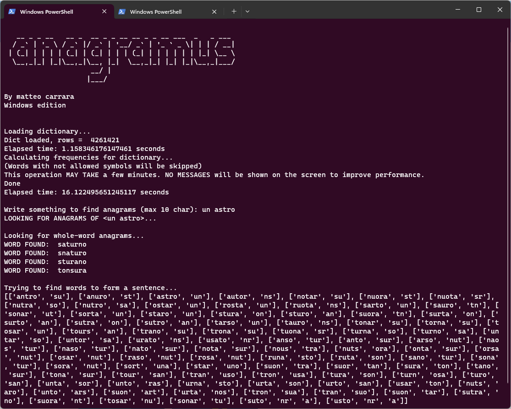

# Anagramus
Quick anagram generator
_by Matteo Carrara_

# How to run
Clone/download the repository, then you should run

```
 python .\anagram.py
```

inside the same directory as *italiano.txt* since it will be loaded at run time (currentyly this program only supports italian words). 

# Example
.

# What is an anagram?
Regarding this software, an anagram is defined as follows:
an anagram of a word or a phrase T is a permutation of all characters of T (excluding spaces), that contains one or more words from a specific language AND uses every single character of T (so that the anagram can be reversed back to the original form).

To check if a word/combination of words is an anagram of another word/set of words, there is included a script "is_anagram" to check it.

